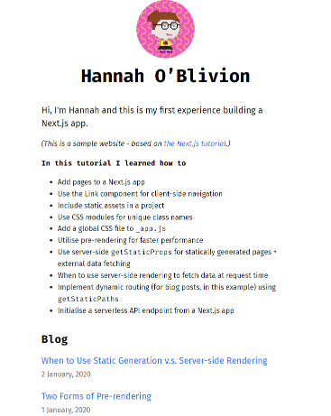

## NextJS Tutorial

Starting to learn NextJs by following the tutorial from the [Next.JS docs](httpsnextjs.orglearnbasicscreate-nextjs-app).

Deployed to Vercel at [https://nextjstutorial-gglgla5l9-hcmcfarlane.vercel.app/](https://nextjstutorial-gglgla5l9-hcmcfarlane.vercel.app/)

In this tutorial I learned how to

-   Add pages to a Next.js app
-   Use the Link component for client-side navigation
-   Include static assets in a project
-   Use CSS modules for unique class names
-   Add a global CSS file to `_app.js`
-   Utilise pre-rendering for faster performance
-   Use server-side `getStaticProps` for statically generated pages + external data fetching
-   When to use server-side rendering to fetch data at request time
-   Implement dynamic routing (for blog posts, in this example) using `getStaticPaths`
-   Initialise a serverless API endpoint from a Next.js app
 
 

